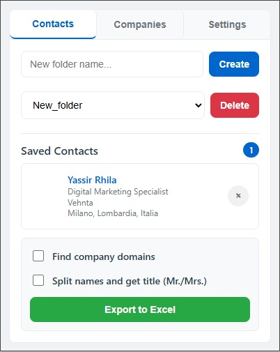
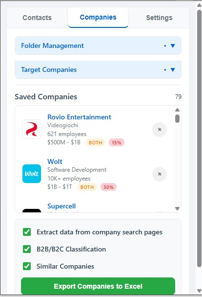
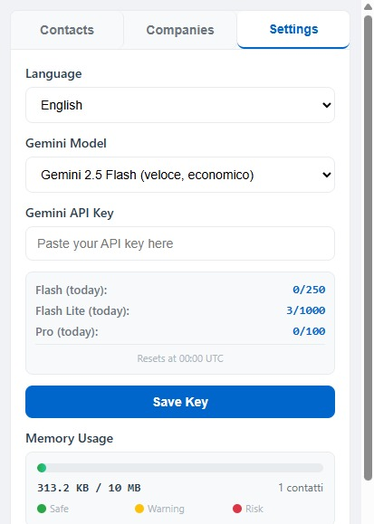

# LinkedIn Lead Extractor


## The Problem → Solution → Impact

<div align="center">

| 🚫 **The Problem** | 💡 **The Solution** | 📈 **The Impact** |
|:-------------------|:---------------------|:-------------------|
| **Data Miner costs $100/month**<br/>Manual data formatting required<br/>Time-consuming integration work | **Chrome extension**<br/>Automatic LinkedIn data extraction<br/>Built-in formatting & Excel export | **💰 $1,200/year savings**<br/>**⚡ 100% reduction** in manual work<br/>**🎯 Ready-to-use data** |
| **Manual lead research**<br/>Time-consuming process<br/>Error-prone data collection | **AI-powered automation**<br/>Gemini integration<br/>Smart company classification | **🚀 90% faster** lead qualification<br/>**🎯 Higher accuracy**<br/>**⚡ Instant processing** |
| **Inconsistent data formats**<br/>Difficult CRM integration<br/>Additional cleanup required | **Standardized Excel exports**<br/>Organized folder structure<br/>CRM-ready formatting | **🔄 Seamless integration**<br/>**📊 Professional reports**<br/>**✅ Zero cleanup needed** |

</div>

---

## Why I Built This

Working in sales automation, I saw our team spending hours on manual lead formatting while paying $100/month for Data Miner. The process was frustrating: extract data manually, spend additional time cleaning and formatting it, then struggle with CRM integration.

I built this solution to solve both problems at once - eliminate the recurring cost and the time waste. The result? Our lead processing went from a tedious daily task to a simple one-click operation, saving both money and countless hours of manual work.

**The goal was simple:** Build something that simplifies the job to its maximum core, eliminating all manual labor parts. Compared to before, the workload has been drastically reduced.

---

## Screenshots

<div>

### Contact Management Interface


*Organized lead extraction with folder management and real-time progress tracking*

### Company Intelligence Dashboard  


*AI-powered company classification and data enrichment in action*

### Settings & Configuration


*Simple configuration with AI model selection and usage monitoring*

</div>

---

## Table of Contents

- [Quick Start](#quick-start)
- [Key Features](#key-features)
- [Installation Guide](#installation-guide)
- [Configuration](#configuration)
- [Usage Examples](#usage-examples)
- [AI Integration](#ai-integration)
- [Technical Details](#technical-details)
- [Troubleshooting](#troubleshooting)
- [Future Enhancements](#future-enhancements)

---

## Quick Start

1. **Install the extension** in Chrome developer mode
2. **Get a Gemini API key** from [Google AI Studio](https://aistudio.google.com/)
3. **Configure the extension** with your API key
4. **Visit LinkedIn** and start extracting leads with automatic data formatting

**Ready to use in under 5 minutes.**

---

## Key Features

### **Core Functionality**
- **One-click data extraction** from LinkedIn profiles and company pages
- **Automatic Excel formatting** with professional spreadsheet generation
- **Organized folder system** for categorizing leads by campaign or industry
- **Real-time progress tracking** for bulk operations

### **AI-Powered Enhancements**
- **Company classification** (B2B/B2C detection with confidence scores)
- **Domain discovery** and website verification
- **Professional name parsing** with title extraction
- **Duplicate detection** and data validation

### **Export & Integration**
- **CRM-ready Excel files** with pivot tables and charts
- **Multi-language support** (English/Italian)
- **Batch processing** for high-volume campaigns
- **Data linking** between contacts and company intelligence

---

## Installation Guide

### Step 1: Download the Extension
```bash
git clone https://github.com/Yassir00000/linkedin-lead-extractor.git
cd linkedin-lead-extractor/Chrome-extention
```

### Step 2: Load in Chrome
1. Open `chrome://extensions/`
2. Enable **"Developer mode"** (top right toggle)
3. Click **"Load unpacked"**
4. Select the `Chrome-extention` folder
5. Pin the extension to your toolbar

### Step 3: Configure AI Integration
1. Get your **Gemini API key** from [Google AI Studio](https://aistudio.google.com/)
2. Click the extension icon
3. Go to **Settings** tab
4. Enter your API key
5. Select your preferred model

**Installation complete!**

---

## Configuration

### AI Model Selection

| Model | Speed | Cost | Rate Limits | Best For |
|-------|--------|------|-------------|----------|
| **Gemini Flash** | Fast | Balanced | 10 RPM, 250 RPD | Standard workflows |
| **Gemini Flash Lite** | Very Fast | Cheap | 15 RPM, 1000 RPD | High-volume campaigns |
| **Gemini Pro** | Standard | Premium | 5 RPM, 100 RPD | Complex analysis |

**Rate limits reference:** [Gemini API Documentation](https://ai.google.dev/gemini-api/docs/api-key)

### Folder Organization
- Create folders by **campaign**, **industry**, or **territory**
- Organize leads for easy CRM import
- Maintain clean data structure

---

## Usage Examples

### Example 1: Company Lead Extraction
1. Navigate to a LinkedIn company page
2. Click the floating extraction button
3. Select target roles (Sales Manager, Director, etc.)
4. Choose your folder destination
5. Export formatted Excel file

### Example 2: Bulk Profile Processing
1. Perform a LinkedIn search
2. Use batch extraction mode
3. AI automatically classifies companies
4. Export with enriched data (domains, industries, etc.)
5. Import directly to your CRM

---

## AI Integration

### Cloud AI (Recommended)
Uses **Google Gemini models** for:
- Company type detection (B2B/B2C)
- Industry classification
- Domain validation
- Name standardization

### Local AI Support
For privacy-sensitive environments:
- **Ollama** integration
- **LocalAI** Docker deployment
- **LM Studio** compatibility

*Modify `background.js` API endpoints for local deployment.*

---

## Technical Details

### Architecture
- **Service Worker** (`background.js`) - AI processing and API management
- **Content Script** (`content.js`) - LinkedIn page integration
- **Popup Interface** (`popup.html/js`) - User control panel
- **Excel Library** (`xlsx.full.min.js`) - Spreadsheet generation

### System Requirements
- Chrome 88+
- 4GB RAM minimum
- Active internet connection (for AI features)

### File Structure
```
Chrome-extention/
├── manifest.json          # Extension configuration
├── background.js           # Core processing logic
├── content.js             # LinkedIn integration
├── popup.html/js          # User interface
├── libs/xlsx.full.min.js  # Excel generation
└── icons/                 # Extension icons
```

---

## Troubleshooting

### Common Issues

**Extension not working on LinkedIn**
- Refresh the LinkedIn page after installation
- Check that extension is enabled in Chrome settings
- Verify you're on `https://www.linkedin.com/*`

**AI features not working**
- Validate Gemini API key in Settings
- Check API quota limits in [Google AI Studio](https://aistudio.google.com/)
- Ensure stable internet connection

**Export problems**
- Check browser download permissions
- Ensure sufficient disk space
- Use smaller batch sizes for large datasets

**Performance issues**
- Monitor memory usage in Settings dashboard
- Clear extension data when storage is full
- Switch to Gemini Flash Lite for high-volume processing

### Debug Information
- **Extension logs:** Settings → Export Logs
- **Console errors:** Chrome DevTools → Console tab
- **Service worker:** Chrome Extensions → Inspect Views

---

## License

MIT License - see [LICENSE](LICENSE) file for details.

**Note:** This extension is independent software and not affiliated with LinkedIn Corporation. Users must comply with LinkedIn's Terms of Service.

---

## Future Enhancements

### **Email Discovery Integration**
- **Apollo.io/Hunter.io API** - Automatic email lookup for extracted LinkedIn profiles
- **Email validation** - Verify deliverability before export

### **CRM Integration**
- **Direct Salesforce/HubSpot sync** - One-click export to major CRM platforms
- **Custom field mapping** - Configure data fields for specific CRM requirements

### **Bulk Processing**
- **Company list upload** - Process entire company databases automatically
- **Scheduled extraction** - Set up automated daily/weekly lead generation

### **Lead Intelligence**
- **Duplicate detection** - Smart merging across extraction sessions
- **Lead scoring** - Basic qualification based on role seniority and company size

---

<div align="center">

**Built by [Yassir00000](https://github.com/Yassir00000)**

*Practical automation tools for real business problems*

</div>