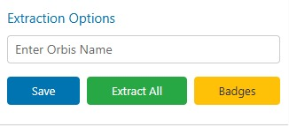

# LinkedIn Lead Intelligence Platform

[](https://chrome.google.com/webstore)
[](LICENSE)
[]()

Enterprise-grade LinkedIn lead extraction and data enrichment platform. Transform LinkedIn connections into actionable business intelligence with AI-powered contact qualification and company analysis.



## Business Value

**Reduce lead research time by 90%** while increasing data quality and accuracy. This platform automates the entire lead qualification workflow, from initial contact discovery to comprehensive company analysis and CRM-ready data export.

**Target Users:**
- Sales development teams scaling outbound efforts
- Business development professionals building prospect databases  
- Marketing teams conducting market research and lead scoring
- Recruitment agencies managing candidate pipelines

## Core Capabilities

### Intelligent Contact Extraction
- Extract qualified leads from LinkedIn profiles, search results, and company pages
- Process multiple contacts simultaneously with real-time progress tracking
- Automated duplicate detection and data validation
- Visual contact status indicators for workflow management

### AI-Powered Data Enrichment
- Multi-model AI support (Gemini 2.5 Flash, Pro, and local deployment options)
- Automated B2B/B2C company classification and industry analysis
- Company domain discovery and website verification
- Contact name parsing with professional title extraction
- Company similarity scoring for market segmentation

### Enterprise Data Management
- Organized folder structure for contacts and companies
- Professional Excel export with advanced formatting and pivot tables
- Linked data relationships between contacts and company intelligence
- Built-in storage optimization and performance monitoring

### Production-Ready Features
- Multi-language support (English, Italian) with extensible localization
- API rate limiting and intelligent usage management
- Advanced caching system to minimize external API calls
- Comprehensive logging and error recovery mechanisms

## Platform Overview

### Contact Management Dashboard

*Streamlined contact organization with folder management and AI-powered enrichment controls*

### Company Intelligence Analysis  

*Automated company classification, revenue analysis, and competitive intelligence*

### Configuration and Monitoring

*AI model configuration, API usage tracking, and performance monitoring*

## Installation and Setup

### Chrome Extension Installation

1. **Download the Platform**
   ```bash
   git clone https://github.com/Yassir00000/linkedin-lead-extention.git
   cd linkedin-lead-extention/Chrome-extention
   ```

2. **Load Extension in Chrome**
   - Navigate to `chrome://extensions/`
   - Enable "Developer mode" in the top right
   - Click "Load unpacked" and select the `Chrome-extention` folder
   - Pin the extension to your toolbar for easy access

3. **Configure AI Integration**
   - Click the extension icon in your Chrome toolbar  
   - Navigate to the Settings tab
   - Enter your Gemini API key (obtain from Google AI Studio)
   - Select your preferred AI model based on usage requirements

### Quick Start Workflow

1. **Initialize LinkedIn Session** - Navigate to any LinkedIn profile, search results, or company page
2. **Launch Control Panel** - Click the extension icon to open the management interface  
3. **Create Organization Structure** - Set up folders to categorize contacts by campaign, industry, or territory
4. **Begin Lead Extraction** - Use the floating action buttons that appear on LinkedIn pages to capture contact data
5. **Configure Enrichment** - Enable AI-powered features like domain discovery, name parsing, and company classification
6. **Generate Reports** - Export enriched data to Excel for CRM import or further analysis

## AI Model Configuration

### Cloud-Based AI Models (Recommended)

The platform supports multiple Gemini AI models optimized for different business requirements:

| Model | Processing Speed | Cost Efficiency | Rate Limits | Optimal Use Case |
|-------|-----------------|----------------|-------------|------------------|
| **Gemini 2.5 Flash** | High | Balanced | 10 RPM, 250 RPD | Standard lead enrichment workflows |
| **Gemini 2.5 Flash Lite** | Very High | Maximum | 15 RPM, 1000 RPD | High-volume lead processing campaigns |
| **Gemini 2.5 Pro** | Standard | Premium | 5 RPM, 100 RPD | Complex company analysis and classification |

### On-Premise AI Deployment

For enterprise environments requiring data privacy or offline capabilities, the platform supports local AI deployment:

#### Supported Local AI Platforms
- **Ollama** - Open-source model serving platform
- **LocalAI** - Docker-based local inference server  
- **LM Studio** - Desktop AI model management interface

#### Enterprise Configuration
Local model integration requires modification of the API endpoint configuration in `background.js`. Detailed technical documentation is available in [TECHNICAL.md](TECHNICAL.md).

## Configuration Management

### Contact Data Enrichment
- **Company Domain Discovery** - Automatically identify and verify company websites
- **Professional Name Parsing** - Intelligent splitting of full names with title detection
- **Custom Field Management** - Add custom identifiers and tracking fields for CRM integration

### Company Intelligence Features
- **Business Model Classification** - Automated B2B/B2C categorization with confidence scoring
- **Competitive Analysis** - Identify similar companies based on configurable criteria
- **Industry Classification** - Detailed sector and vertical analysis
- **Company Sizing** - Employee count and revenue range estimation

### Data Export and Integration
- **Professional Excel Reports** - Formatted spreadsheets with pivot tables and charts
- **Linked Data Architecture** - Combine contact and company intelligence in unified exports  
- **CRM-Ready Formatting** - Standard field mapping for major CRM platforms
- **Multi-language Support** - Localized headers and formatting options

## Technical Architecture

The platform follows a modular Chrome extension architecture optimized for performance and scalability:

- **Service Worker** (`background.js`) - Handles AI processing and API management
- **Content Script** (`content.js`) - LinkedIn page integration and data extraction
- **Popup Interface** (`popup.html/js`) - User control panel and configuration
- **Excel Library** (`libs/xlsx.full.min.js`) - Professional spreadsheet generation

## Development and Deployment

### System Requirements
- Chrome browser (version 88+)
- Gemini API access or local AI infrastructure
- 4GB RAM minimum for optimal performance

### Production Deployment
The platform is designed for immediate deployment without build processes. Load directly in Chrome developer mode for development or package for Chrome Web Store distribution.

Detailed technical documentation, API specifications, and development guidelines are available in [TECHNICAL.md](TECHNICAL.md).

## Support and Documentation

### Common Solutions

**Platform Compatibility**
- Requires LinkedIn pages (`https://www.linkedin.com/*`) for data extraction
- Verify extension is enabled in Chrome extension management
- Refresh LinkedIn pages after initial installation or updates

**API Configuration**
- Validate Gemini API key accuracy in Settings panel
- Monitor usage limits and quotas through the built-in tracker
- Ensure stable network connectivity for cloud AI models
- For local AI deployments, verify server status and endpoint accessibility

**Data Export Troubleshooting**  
- Confirm sufficient local storage space for Excel file generation
- Check browser popup blocker settings for download permissions
- Validate contact data exists before attempting export operations
- Use smaller batch sizes for large datasets to prevent timeout issues

**Performance Optimization**
- Monitor memory usage through the Settings dashboard
- Clear extension data when approaching storage limits
- Adjust batch processing sizes based on system capabilities
- Consider Gemini Flash Lite for high-volume processing scenarios

### Technical Support

**Debug Access:**
- Extension Settings → Export Logs for comprehensive troubleshooting data
- Chrome DevTools Console for real-time debugging
- Extension Details → Inspect Views for service worker debugging

**Enterprise Support:**
For enterprise deployments, custom integrations, or technical consulting, contact through GitHub Issues with the "Enterprise" label.

## License and Compliance

This project is released under the MIT License. See [LICENSE](LICENSE) for complete terms and conditions.

**Important:** This platform operates independently and is not affiliated with LinkedIn Corporation. Users must comply with LinkedIn's Terms of Service and applicable data protection regulations.

## Product Roadmap

### Near-Term Enhancements
- **Direct CRM Integration** - Native connectors for Salesforce, HubSpot, and Pipedrive
- **Advanced Lead Scoring** - ML-based qualification and prioritization algorithms  
- **Team Collaboration** - Shared workspaces and collaborative lead management
- **API Ecosystem** - Support for additional AI providers and custom model integration

### Strategic Development  
- **Mobile Application** - iOS/Android companion for remote lead management
- **Cloud Synchronization** - Cross-device data sync and backup capabilities
- **Enterprise Analytics** - Advanced reporting and team performance metrics
- **Workflow Automation** - Automated lead nurturing and follow-up sequences

---

**Professional Lead Intelligence Platform for LinkedIn**

*Independent software solution - not affiliated with LinkedIn Corporation*